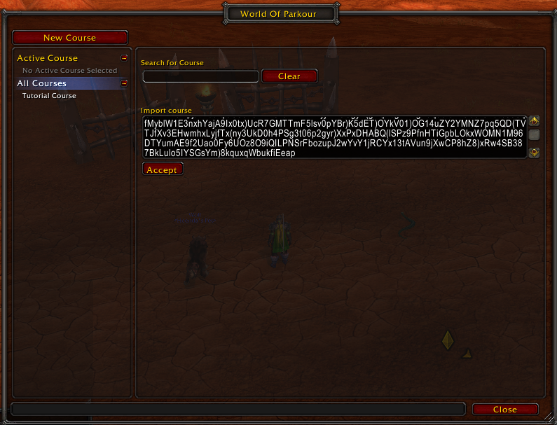

# WorldofParkour
World of Warcraft addon: Parkour puzzles throughout the world.

# Table of Contents

- [WorldofParkour](#worldofparkour)
- [Table of Contents](#table-of-contents)
- [Features](#features)
- [Known Issues](#known-issues)
- [Quick Start](#quick-start)
- [How to Run a Course](#how-to-run-a-course)
- [Course Creation](#course-creation)
- [Course Sharing](#course-sharing)
- [Commands](#commands)
- [Tips & Tricks](#tips--tricks)
- [Useful links](#useful-links)

# Features

* Easily create parkour courses anywhere around World of Warcraft.
* Share courses with friends.
* Uses TomTom waypoints to easily show the course points.

# Known Issues

1. **DO NOT right-click the Crazy Waypoint Arrow that TomTom provides and use any of those options.** It can easily bug out your course run or creation.
2. TomTom seems to not always want to clear points even when you are standing on them. So if this occurs, just right click the point on the minimap and press `Complete point` to manually complete it.


# Quick Start

To open WorldOfParkour, type `/wop` or `/parkour` into your chat and hit enter.

# How to Run a Course

Simply pick a course from the `All Courses` tab and set it as the `Active Course`.

# Course Creation

Below is a short gif creating a simple parkour course.


# Course Sharing

1. Sharing a Course

    Press the `Show sharable course string` toggle. Copy and paste the string to your friends.

    

2. Importing a Course

    Press the `All Courses` tab and paste the course string into the `Import course` input box.

    


# Commands

1. `/wop` or `/parkour` to open the WorldOfParkour UI.

2. `/wopsetpoint`: Set the next point for the course. Equivalent to pressing `Add Point` in the UI.
   1. Example:

   ```
    Points: [1, 2, 3, 4, 5]
    /wopsetpoint
    Points: [1, 2, 3, 4, 5, 6]
                            ^
                            This is the new point.
   ```

3. `/wopsetpointafter`: Set a point after another existing point in the course. Equivalent to pressing `Add point after` or `Add point to beginning` in the UI. 
   1. `args`
      1. `Index[number]`: Index of the point to add another point after.
   2. Example: 
    
    ```
    Points: [1, 2, 3, 4, 5]
    /wopsetpointafter 2
    Points: [1, 2, 3, 4, 5, 6]
                   ^
                   This is the new point.
    ```

# Tips & Tricks

1. Create a macro with `/wopsetpoint` and add it to your action bar to quickly add points to a course without opening the WorldOfParkour UI _(NOTE: You need to be editing the course for `/wopsetpoint` to work.)_.
2. Hints for each point can be seen by right clicking the minimap point icon and clicking `Show hint`.
   
# Useful links

https://wow.gamepedia.com/UI_escape_sequences